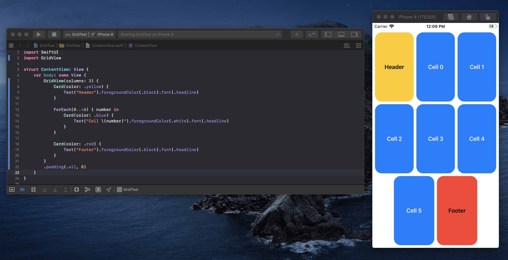

# GridView

GridView allows you to Render SwiftUI Views in a Grid.

## Usage

**Why use GridView instead of any other SwiftUI Grid Framework?** Good question!
Well GridView is actually not too fancy. But it's the most flexible one out there.

### You can just add anythin you want

Here's a View that uses GridView with two views lying around, and a ForEach in the middle:

```swift
struct ContentView: View {
    var body: some View {
        GridView(columns: 3) {
            Card(color: .yellow) {
                Text("Header").foregroundColor(.black).font(.headline)
            }

            ForEach(0..<6) { number in
                Card(color: .blue) {
                    Text("Cell \(number)").foregroundColor(.white).font(.headline)
                }
            }

            Card(color: .red) {
                Text("Footer").foregroundColor(.black).font(.headline)
            }
        }
        .padding(.all, 8)
    }
}
```



Well all those views are then magically added to the View. Similarly to how HStack works. And that's the point. GridView is supposed to feel like it was added by Apple.

## Installation
### Swift Package Manager

You can install GridView via [Swift Package Manager](https://swift.org/package-manager/) by adding the following line to your `Package.swift`:

```swift
import PackageDescription

let package = Package(
    [...]
    dependencies: [
        .package(url: "https://github.com/nerdsupremacist/GridView.swift.git", from: "0.1.0"),
    ]
)
``` 

## Contributions
Contributions are welcome and encouraged!

## License
GridView is available under the MIT license. See the LICENSE file for more info.
